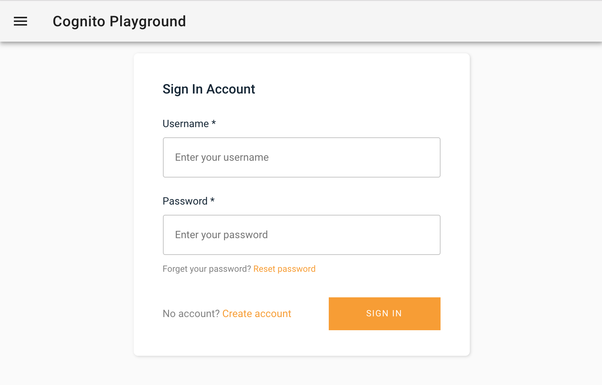
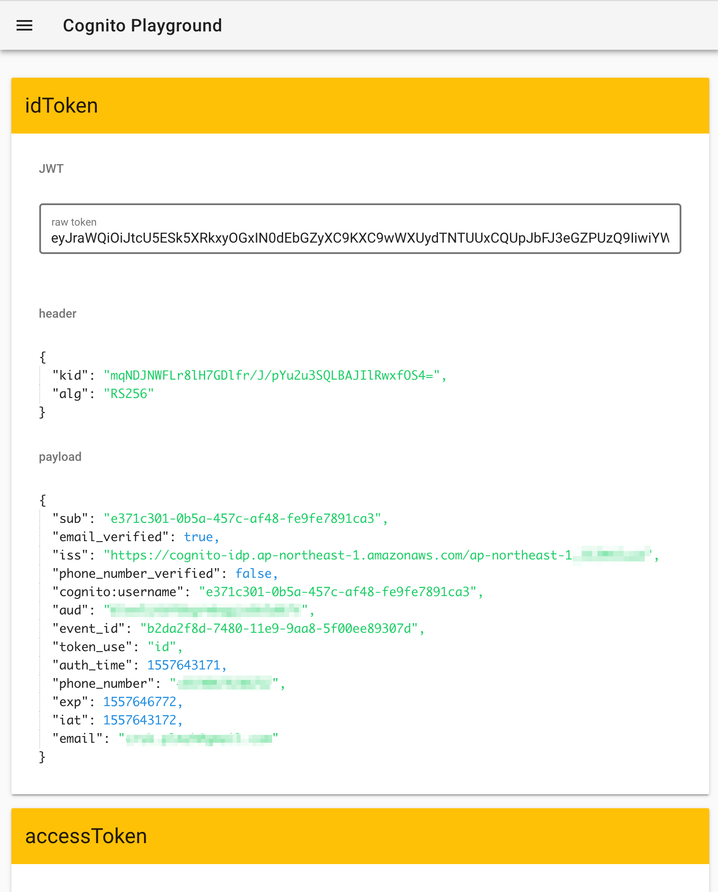

# Cognito Viewer

 * Improve your development with Amplify and Cognito in local.
   * Authentication flow with Amplify.
   * View idToken, accessToken, refreshToken pretty.
   * View .well-known/jwks.json pretty.

## ScreenShot





## Setup

```shell
cp .env.sample .env
```

```
AUTH_IDENTITYPOOLID=ap-northeast-1:xxxxxxxx-xxxx-xxxx-xxxx-xxxxxxxxxxxx
AUTH_REGION=ap-northeast-1
AUTH_USERPOOLID=ap-northeast-1_xxxxxxxxx
AUTH_USERPOOLWEBCLIENTID=xxxxxxxxxxxxxxxxxxxxxxxxxx
```


```
npm install
npm run dev
```

